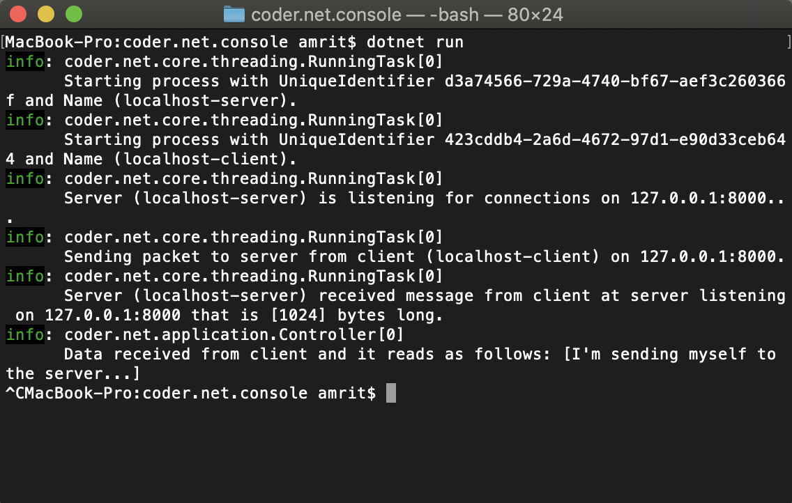
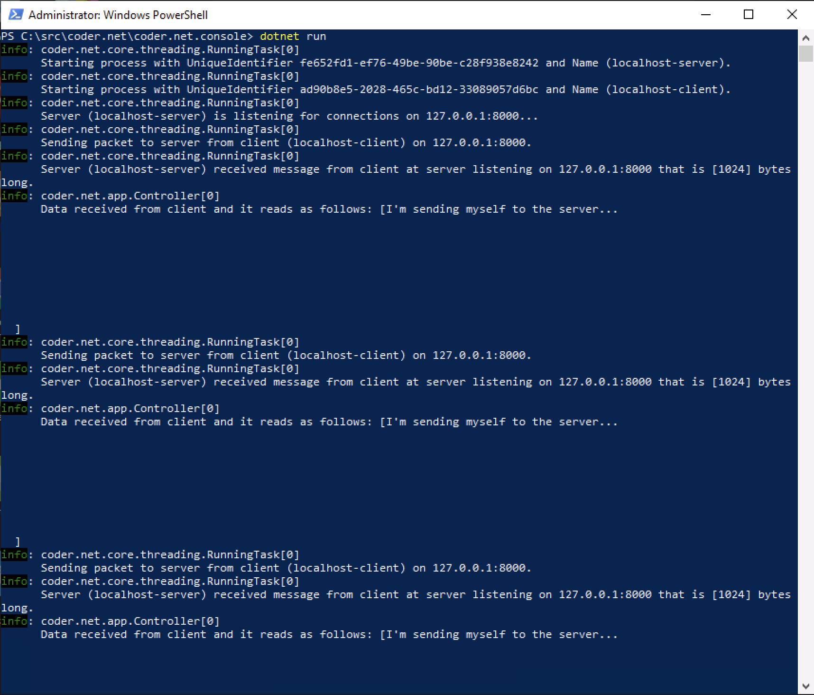
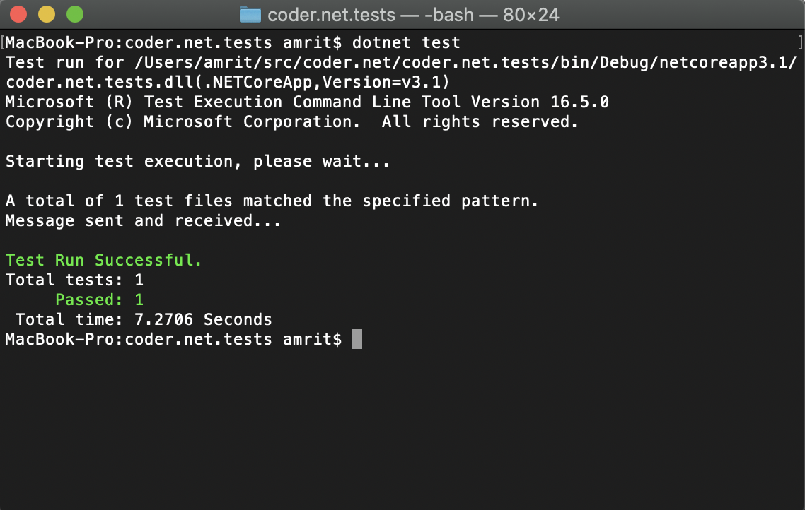
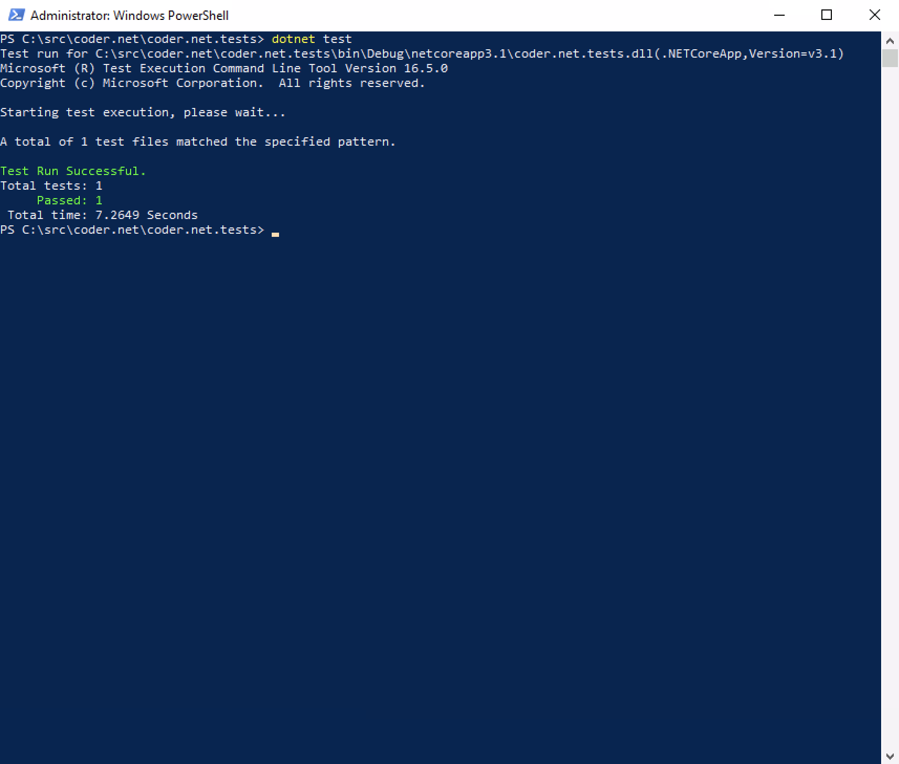

# coder.net
This is a a customized TCP/IP communications modeule written in .NET Core 3.1

Coded by Amrit Kohli (C) 2020, All rights reserved.

It highlights some important features of .NET Core 3.1, C#, and TCP/IP, and demonstrates my aptitude for writing good, clean, professional, and performant code.

## To Run This Project
To see this project in action, run the following commands:

`git clone https://github.com/akohli74/coder.net.git`

`cd coder.net/coder.net.console`

`dotnet run`

By doing this, you will see the Client sending the same message to the Server over and over again, as shown by the output from the application while it's running as shown here:

For best results, and performance, use a device with a Windows OS on it, as shown here:

But you can still run it on macOS or Linux.  For macOS, you must install the dotnet core v3.1 SDK which can be found here:

[dotnet core 3.1 SDK](https://dotnet.microsoft.com/en-us/download/dotnet/thank-you/runtime-3.1.32-macos-x64-installer?cid=getdotnetcore)

## To Run The Tests In This Project

To run the tests in this project, run the following commands:

`git clone https://github.com/akohli74/coder.net.git`

`cd coder.net/coder.net.tests`

`dotnet test`

The tests will pass, as shown here:

For best results, and performance, use a device with a Windows OS on it, as shown here:

# Features and Code Writeup

### .NET Core

  * I used the built-in IoC features of .NET Core, which can be seen in Program.cs of the Console app.
  * I used the built-in Configuration features of .NET Core, which can be seen throughout the application.
  * I used the built-in Logging features of .NET Core, which can seen throughout the application.
  * I used xunit to demonstrate the system working in what is more like an integration test, which can be found in ServerTests.cs.
  
### C#

  * I made use of some of the new features in C#, like switch expressions, as can be seen in Controller.cs
  * I make heavy use of the async/await pattern to improve the performance of the library.
  * I use the newish CancellationTokenSource pattern to stop Tasks that are running.
  
### TCP/IP

  * I created a Server (Listener) that will establish a connection with a client that initiates a connection to it.
  * I created a Client (Sender) that will initiate a connection to a server.
  * All of my communications are handled as asynchronous communications.
  
### Running Task
  * I created a new Base class for all "runnable" Tasks.  These are called "RunningTasks."  
  * The base class handles all the logic to Start, Stop, Restart, and Dispose of a "runnable" Task.

#### Limitations/Known Issues
  * Can only have one server and one client at a time.  Future versions will support a collection of Servers and Clients.
  * dotnet core v3.1 runs incredibly slowly on macOS systems and it is very buggy.
  * Visual Studio's IDE has major bugs on macOS systems, often requiring a restart to correct.
